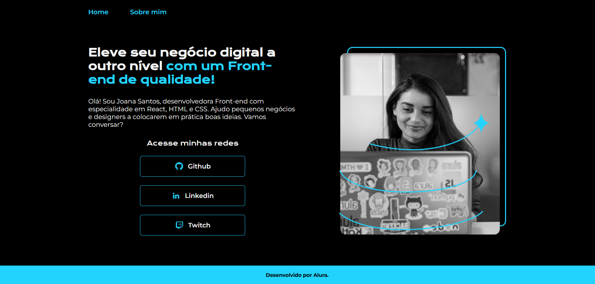
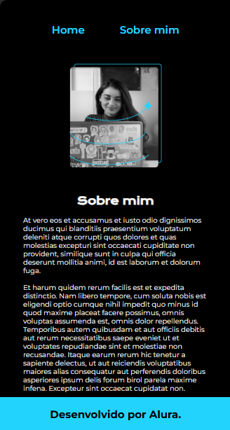

# Lading Page / Portifólio 

>Curso HTML e CSS: trabalhando com responsividade e publicação de projetos da Alura com a Rafa Ballerine e o Guilherme Silveira

### Projeto de Estudo CSS e HTML com foco em acessibilidade e performance

### Plataformas 
* VS Code
* Git 
* Axe DevTools - Web Accessibility Testing
* WAVE Accessibility Tool
* Siteimprove Accessibility Checker
* Vercel

### Skills aprendidos
* Uso do **rem**
* Uso do Media Queria por Tamanho de Interface
* Plataformas de teste de perfomance do site

##

### Interface pra PC

 
  
  

##

### Interface com tamanho menor que 1200px 

 
  
  

###
###

 
  
  
  

